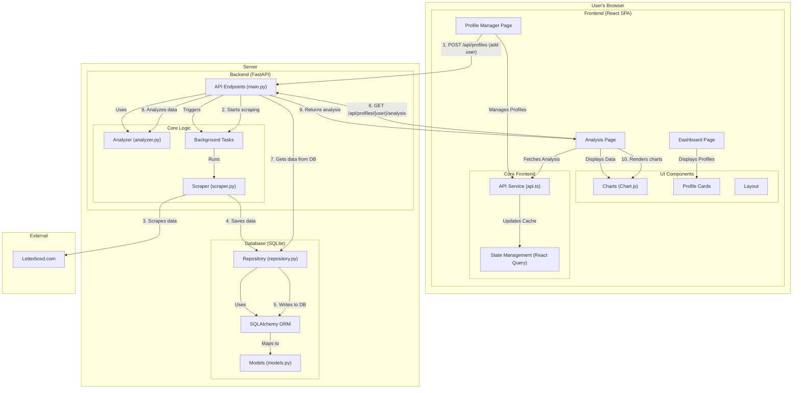

# Letterboxd Reviewer Pro - Developer Documentation

This document provides a comprehensive guide for developers working on the Letterboxd Reviewer Pro project. It covers the architecture, backend, frontend, data flow, and development workflow.

## 1. Architecture Overview

Below is a detailed diagram of the application architecture, illustrating the flow of data and the interaction between the different components.



The application follows a modern client-server architecture:

-   **Frontend**: A Single Page Application (SPA) built with **React** and **TypeScript**. It is responsible for the user interface, data visualization, and user interactions.
-   **Backend**: An asynchronous API server built with **FastAPI**. It handles business logic, data scraping, analysis, and database interactions.
-   **Database**: A **SQLite** database managed by **SQLAlchemy ORM**. It persists user profiles, scraped data, and analysis results.

The communication between the frontend and backend is done via a RESTful API.

---

## 2. Backend (FastAPI)

The backend is responsible for the core logic of the application.

### 2.1. Project Structure

```
backend/
├── config/         # Configuration (settings, prompts)
├── core/           # Business logic (analysis, recommendations)
├── database/       # Database connection, models, and repository
├── main.py         # FastAPI app entry point, API endpoints
├── scraper.py      # Logic for scraping data from Letterboxd
└── letterboxd.db   # SQLite database file
```

### 2.2. API Endpoints

All endpoints are defined in `main.py`. The main endpoints are:

-   `GET /api/profiles`: Fetches all stored user profiles.
-   `POST /api/profiles`: Adds a new profile by username and starts the scraping process.
-   `DELETE /api/profiles/{username}`: Deletes a profile and all associated data.
-   `GET /api/profiles/{username}/analysis`: Retrieves analysis data for a specific user.
-   `GET /api/profiles/{username}/status`: Gets the current scraping status for a user.

### 2.3. Database

-   **ORM**: SQLAlchemy is used for object-relational mapping.
-   **Models**: Defined in `database/models.py`. This includes `User`, `Film`, `Review`, `Rating`, `Like`, etc.
-   **Repository Pattern**: The `database/repository.py` file abstracts the database queries, providing a clean interface for the rest of the application to interact with the database.
-   **Connection**: Managed in `database/connection.py`.

### 2.4. Data Scraping

-   **Scraper Logic**: The `scraper.py` file contains the logic to scrape data from a user's Letterboxd profile. It uses `httpx` for making asynchronous HTTP requests and `BeautifulSoup` for parsing HTML.
-   **Background Tasks**: When a new profile is added, FastAPI starts a background task to scrape the data. This prevents the API from blocking and allows the user to continue using the application.

### 2.5. Data Analysis

-   **Analyzer**: The `core/analyzer.py` file contains the logic for analyzing the scraped data. It calculates statistics like rating distribution, activity by year, and more.
-   **Recommendations**: The `core/recommendations.py` file can be used to generate film recommendations based on the user's data.

---

## 3. Frontend (React)

The frontend is a modern React application built with TypeScript.

### 3.1. Project Structure

```
frontend/
├── build/          # Production build output
├── public/         # Static assets (index.html, favicon)
├── src/
│   ├── components/ # Reusable UI components
│   │   └── Charts/ # Chart components
│   ├── pages/      # Main pages of the application
│   ├── services/   # API communication layer
│   ├── App.tsx     # Main app component with routing
│   ├── index.css   # Global styles
│   └── index.tsx   # Application entry point
├── package.json
└── tailwind.config.js
```

### 3.2. State Management

-   **React Query**: Used for managing server state. It handles fetching, caching, and updating data from the backend API, providing a robust and efficient way to manage asynchronous data.

### 3.3. Components

-   **UI Components**: Located in `src/components`, these are general-purpose components like `Layout.tsx`, `LoadingSpinner.tsx`, and `ProfileCard.tsx`.
-   **Chart Components**: Located in `src/components/Charts`, these components are responsible for rendering the charts using `Chart.js` and `react-chartjs-2`.

### 3.4. Pages

-   `Dashboard.tsx`: The main landing page.
-   `ProfileManager.tsx`: The page for adding, viewing, and managing Letterboxd profiles.
-   `Analysis.tsx`: The page that displays the detailed analysis and visualizations for a selected profile.
-   `Scraper.tsx`: A utility page for scraping-related actions.

### 3.5. Styling

-   **TailwindCSS**: A utility-first CSS framework is used for styling. The configuration is in `tailwind.config.js`.
-   **PostCSS**: Used with TailwindCSS for processing CSS.

### 3.6. API Service

-   The `src/services/api.ts` file contains all the functions for making API calls to the backend. This centralizes the API logic and makes it easy to manage.

---

## 4. Development Workflow

### 4.1. Setup

1.  **Clone the repository**.
2.  Run `./scripts/setup.sh` to install dependencies for both frontend and backend.

### 4.2. Running the Application

-   Run `./scripts/start-all.sh` to start both the backend and frontend servers concurrently.
-   Alternatively, run `./scripts/start-backend.sh` and `./scripts/start-frontend.sh` in separate terminals.

### 4.3. Testing

-   The `scripts/test_functionality.py` script can be used to run integration tests against the backend API.

---

## 5. Data Flow

1.  **User adds a profile** on the `ProfileManager` page.
2.  **Frontend** sends a `POST` request to `/api/profiles`.
3.  **Backend** creates a new user in the database and starts a background scraping task.
4.  **Scraper** fetches data from Letterboxd, parses it, and stores it in the database via the repository.
5.  **Frontend** periodically polls the `/api/profiles/{username}/status` endpoint to show scraping progress.
6.  Once scraping is complete, the user can navigate to the **Analysis** page.
7.  **Frontend** requests analysis data from `/api/profiles/{username}/analysis`.
8.  **Backend** retrieves the data from the database, performs analysis using the `Analyzer`, and returns the results.
9.  **Frontend** displays the analysis using charts and stats cards.
