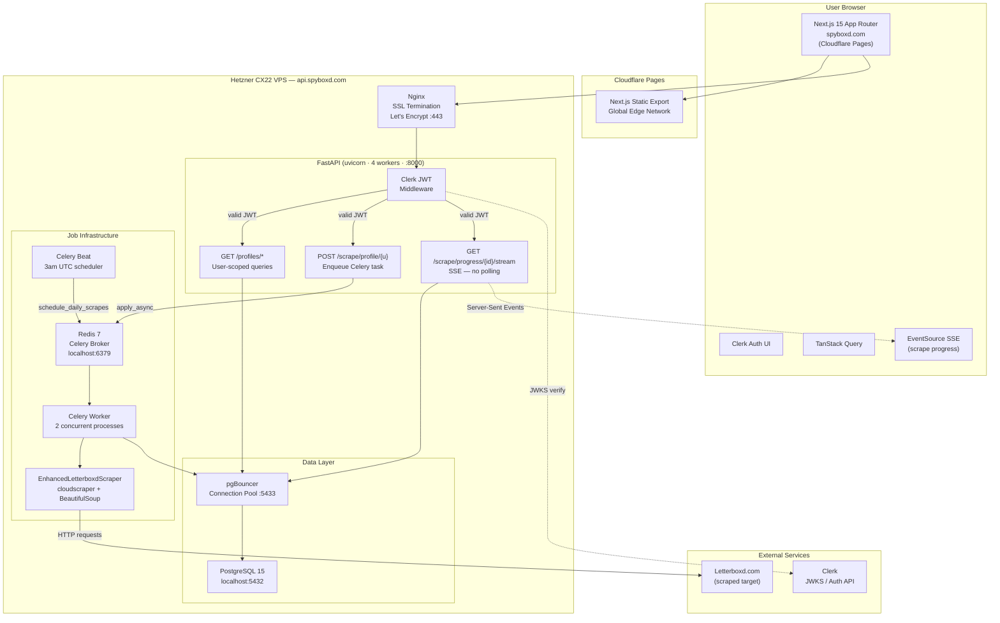

# Deployment Plan: spyboxd.com (Multi-User Production)

## Context

Evolving letterboxd-reviewer from a single-person tool into a multi-user product at spyboxd.com. Users will have accounts, track Letterboxd profiles, and see per-user dashboards. Unique profiles are shared across users (if A and B both track "filmfanatic", it's only scraped once). Daily auto-scraping runs at 3am UTC; users can manually trigger re-scrapes (rate-limited to once per 2 hours per profile).

---

## Architecture Diagram



### Data Flow Narrative

```
1. LOGIN:    Browser → Clerk UI → JWT issued
2. ADD:      Browser → POST /profiles/track → FastAPI (JWT verified)
                     → insert user_tracked_profiles
                     → if new profile: enqueue Celery scrape job
3. SCRAPE:   Celery Worker → EnhancedLetterboxdScraper → Letterboxd.com
                           → writes ratings/reviews to Postgres
                           → updates scraping_jobs.progress_pct
4. PROGRESS: Browser EventSource → GET /scrape/progress/{id}/stream (SSE)
                     ← FastAPI polls DB every 1.5s, pushes JSON events
                     ← connection closes when status = completed/failed
5. DAILY:    Celery Beat (3am UTC) → query profiles last_scraped_at > 23h
                                   → enqueue scrape job for each (deduplicated)
6. MANUAL:   Browser → POST /scrape/manual/{username}
                     → check scrape_rate_limits (2hr window)
                     → if allowed: enqueue + log rate limit record
```

---

## Key Decisions

| Decision | Choice | Reason |
|----------|--------|--------|
| Auth | **Clerk** | Pre-built React components, simple FastAPI JWT verification, 10k MAU free |
| Database | **PostgreSQL on same VPS** | Zero network latency for scraper writes, SQLAlchemy already supports it |
| Job queue | **Celery + Redis** | Long-running scrapes can't block FastAPI workers; celery beat handles daily schedule |
| Progress updates | **SSE (Server-Sent Events)** | Replaces polling; no new infra, native FastAPI support |
| Backend hosting | **Hetzner CX22** | Long-running processes, no timeout limits, cheapest option |
| Frontend hosting | **Cloudflare Pages** | Free global CDN, integrates with Cloudflare DNS (spyboxd.com already on Cloudflare), Next.js static export support |
| Connection pooling | **pgBouncer** | Celery opens many DB connections; pgBouncer keeps Postgres happy |

---

## New Multi-Tenant Database Schema

```sql
-- Users (mirrored from Clerk for foreign keys)
CREATE TABLE users (
    id              UUID PRIMARY KEY DEFAULT gen_random_uuid(),
    clerk_user_id   VARCHAR(64) UNIQUE NOT NULL,
    email           VARCHAR(255) UNIQUE NOT NULL,
    display_name    VARCHAR(100),
    created_at      TIMESTAMPTZ NOT NULL DEFAULT NOW(),
    is_active       BOOLEAN NOT NULL DEFAULT TRUE
);

-- Letterboxd profiles (GLOBAL/SHARED - not per-user)
CREATE TABLE letterboxd_profiles (
    id                  SERIAL PRIMARY KEY,
    username            VARCHAR(50) UNIQUE NOT NULL,
    display_name        VARCHAR(150),
    bio                 TEXT,
    location            VARCHAR(100),
    profile_image_url   VARCHAR(500),
    join_date           DATE,
    avg_rating          FLOAT DEFAULT 0.0,
    total_films         INTEGER DEFAULT 0,
    total_reviews       INTEGER DEFAULT 0,
    scraping_status     VARCHAR(20) NOT NULL DEFAULT 'pending',
    last_scraped_at     TIMESTAMPTZ,
    last_scrape_error   TEXT,
    extended_metadata   JSONB,
    created_at          TIMESTAMPTZ NOT NULL DEFAULT NOW(),
    updated_at          TIMESTAMPTZ NOT NULL DEFAULT NOW()
);

-- Many-to-many: which users track which profiles
CREATE TABLE user_tracked_profiles (
    id          SERIAL PRIMARY KEY,
    user_id     UUID NOT NULL REFERENCES users(id) ON DELETE CASCADE,
    profile_id  INTEGER NOT NULL REFERENCES letterboxd_profiles(id) ON DELETE CASCADE,
    nickname    VARCHAR(100),
    added_at    TIMESTAMPTZ NOT NULL DEFAULT NOW(),
    CONSTRAINT uq_user_profile UNIQUE (user_id, profile_id)
);

-- Ratings (per Letterboxd profile, shared across users)
CREATE TABLE ratings (
    id              BIGSERIAL PRIMARY KEY,
    profile_id      INTEGER NOT NULL REFERENCES letterboxd_profiles(id) ON DELETE CASCADE,
    movie_title     VARCHAR(300) NOT NULL,
    movie_year      SMALLINT,
    film_slug       VARCHAR(200),
    letterboxd_id   VARCHAR(100),
    poster_url      VARCHAR(500),
    rating          FLOAT,
    watched_date    DATE,
    is_rewatch      BOOLEAN NOT NULL DEFAULT FALSE,
    is_liked        BOOLEAN NOT NULL DEFAULT FALSE,
    tags            JSONB,
    CONSTRAINT uq_profile_film UNIQUE (profile_id, film_slug)
);

-- Reviews (per Letterboxd profile, shared)
CREATE TABLE reviews (
    id              BIGSERIAL PRIMARY KEY,
    profile_id      INTEGER NOT NULL REFERENCES letterboxd_profiles(id) ON DELETE CASCADE,
    movie_title     VARCHAR(300) NOT NULL,
    movie_year      SMALLINT,
    film_slug       VARCHAR(200),
    review_text     TEXT,
    rating          FLOAT,
    contains_spoilers BOOLEAN NOT NULL DEFAULT FALSE,
    likes_count     INTEGER DEFAULT 0,
    published_date  DATE,
    CONSTRAINT uq_profile_review UNIQUE (profile_id, film_slug, published_date)
);

-- Scraping job queue
CREATE TABLE scraping_jobs (
    id                      BIGSERIAL PRIMARY KEY,
    profile_id              INTEGER NOT NULL REFERENCES letterboxd_profiles(id) ON DELETE CASCADE,
    triggered_by_user_id    UUID REFERENCES users(id) ON DELETE SET NULL,
    trigger_type            VARCHAR(20) NOT NULL DEFAULT 'scheduled', -- scheduled|manual|initial
    status                  VARCHAR(20) NOT NULL DEFAULT 'queued',    -- queued|in_progress|completed|failed
    celery_task_id          VARCHAR(155),
    progress_stage          VARCHAR(50),
    progress_pct            FLOAT DEFAULT 0.0,
    progress_message        TEXT,
    queued_at               TIMESTAMPTZ NOT NULL DEFAULT NOW(),
    started_at              TIMESTAMPTZ,
    completed_at            TIMESTAMPTZ,
    error_message           TEXT,
    retry_count             SMALLINT NOT NULL DEFAULT 0,
    job_type                VARCHAR(50) NOT NULL DEFAULT 'full_scrape'
);

-- Rate limit log for manual trigger requests
CREATE TABLE scrape_rate_limits (
    id           BIGSERIAL PRIMARY KEY,
    user_id      UUID NOT NULL REFERENCES users(id) ON DELETE CASCADE,
    profile_id   INTEGER NOT NULL REFERENCES letterboxd_profiles(id) ON DELETE CASCADE,
    requested_at TIMESTAMPTZ NOT NULL DEFAULT NOW()
);
```

---

## What Changes vs. Current Code

### Keep unchanged
- `EnhancedLetterboxdScraper` in [backend/scraper.py](backend/scraper.py) — scraper code is fine
- SQLAlchemy ORM layer — just point at Postgres via env var
- FastAPI framework
- Next.js 15 App Router + TypeScript + TanStack Query

### Add
- **Clerk** Next.js SDK (`@clerk/nextjs`) — wrap app in `<ClerkProvider>`, use `auth()` in Server Components
- **FastAPI auth dependency** — `verify_clerk_token()` validates JWT on every route
- **Celery + Redis** — replace `BackgroundTasks` with `scrape_profile_task.apply_async()`
- **Celery Beat** — daily `schedule_daily_scrapes` task at 3am UTC
- **SSE endpoint** — `GET /scrape/progress/{job_id}/stream` replaces polling
- **pgBouncer** — connection pooler on VPS

### Rewrite
- [backend/database/models.py](backend/database/models.py) — new multi-tenant schema
- [backend/main.py](backend/main.py) — add auth middleware, user-scoped routes, Celery dispatch, SSE endpoint
- [frontend/src/services/api.ts](frontend/src/services/api.ts) — inject Clerk JWT into axios, switch to SSE for progress

### Remove
- `BackgroundTasks` pattern in `main.py`
- Frontend polling loop in Scraper page
- SQLite / relative file paths
- ZIP upload flow (optional: keep as admin-only utility)

---

## Critical Business Logic

**Deduplication (prevent double-scraping):**
```python
def enqueue_scrape_if_not_active(profile_id, trigger_type, user_id=None):
    # PostgreSQL advisory lock prevents race conditions
    db.execute("SELECT pg_advisory_xact_lock(:id)", {"id": profile_id})
    active = db.query(ScrapingJob).filter(
        ScrapingJob.profile_id == profile_id,
        ScrapingJob.status.in_(["queued", "in_progress"])
    ).first()
    if active:
        return {"deduplicated": True, "existing_job_id": active.id}
    job = ScrapingJob(profile_id=profile_id, trigger_type=trigger_type, ...)
    db.add(job); db.flush()
    scrape_profile_task.apply_async(args=[job.id])
    return {"job_id": job.id}
```

**Rate limiting (manual triggers):**
```python
def check_rate_limit(user_id, profile_id, window_hours=2):
    cutoff = datetime.utcnow() - timedelta(hours=window_hours)
    return db.query(ScrapeRateLimit).filter(
        ScrapeRateLimit.user_id == user_id,
        ScrapeRateLimit.profile_id == profile_id,
        ScrapeRateLimit.requested_at > cutoff
    ).first() is not None
```

**Daily scheduler (Celery Beat):**
```python
@celery_app.task
def schedule_daily_scrapes():
    profiles = db.query(LetterboxdProfile).filter(
        or_(
            LetterboxdProfile.last_scraped_at == None,
            LetterboxdProfile.last_scraped_at < datetime.utcnow() - timedelta(hours=23)
        )
    ).all()
    for profile in profiles:
        enqueue_scrape_if_not_active(profile.id, trigger_type="scheduled")
```

**SSE progress stream (replaces polling):**
```python
@app.get("/scrape/progress/{job_id}/stream")
async def stream_job_progress(job_id: int, user=Depends(verify_clerk_token)):
    async def generator():
        deadline = asyncio.get_event_loop().time() + 900  # 15min max
        while asyncio.get_event_loop().time() < deadline:
            job = db.query(ScrapingJob).filter(ScrapingJob.id == job_id).first()
            yield f"data: {json.dumps({'status': job.status, 'pct': job.progress_pct})}\n\n"
            if job.status in ("completed", "failed"):
                break
            await asyncio.sleep(1.5)
    return StreamingResponse(generator(), media_type="text/event-stream",
                             headers={"X-Accel-Buffering": "no"})
```

---

## VPS Process Layout (systemd services)

```
postgresql.service      # Postgres DB, local only
pgbouncer.service       # Connection pooler :5433
redis.service           # Celery broker, local only
spyboxd-api.service     # uvicorn main:app --workers 4 --port 8000
spyboxd-worker.service  # celery -A tasks worker --concurrency 2
spyboxd-beat.service    # celery -A tasks beat
nginx.service           # Reverse proxy + SSL
```

---

## Implementation Phases

| Phase | Work | Duration |
|-------|------|----------|
| 1 | Migrate SQLite → Postgres; update models for multi-tenancy; run Alembic | 2-3 days |
| 2 | Add Clerk auth to React + FastAPI JWT middleware; `users` table + `user_tracked_profiles` | 2-3 days |
| 3 | Replace BackgroundTasks with Celery + Redis; move scraper into Celery task | 2-3 days |
| 4 | Add SSE progress endpoint; update frontend EventSource | 1 day |
| 5 | Add Celery Beat daily scheduler | 1 day |
| 6 | Provision Hetzner, configure systemd, Nginx SSL, deploy | 1-2 days |
| 7 | Deploy frontend to Cloudflare Pages, point spyboxd.com DNS (already on Cloudflare) | 0.5 day |

---

## Cost (Monthly)

| Service | Cost |
|---------|------|
| Hetzner CX22 (VPS) | ~$5/month |
| Cloudflare Pages (Next.js frontend) | $0 |
| Clerk (up to 10k MAU) | $0 |
| Domain (already on Cloudflare) | ~$1/month |
| **Total** | **~$6/month** |

Scale-up: if scrape queue grows, upgrade to Hetzner CX32 (~$8.50) or add a second worker node. Clerk stays free until 10k users.

---

## Verification

1. `docker compose up` locally → all services start
2. Sign up via Clerk → JWT is verified by FastAPI → user row created in `users` table
3. Add a Letterboxd username → `user_tracked_profiles` row created, scrape queued
4. SSE stream shows progress without polling
5. Add same username as a second user → existing profile reused, not re-scraped if fresh
6. Wait for 3am or manually trigger `schedule_daily_scrapes` → all stale profiles queued
7. Manual trigger within 2hr window → 429 rate limit response
8. `https://spyboxd.com` loads Next.js app from Cloudflare Pages
9. `https://api.spyboxd.com/docs` serves FastAPI docs (Nginx proxied)
