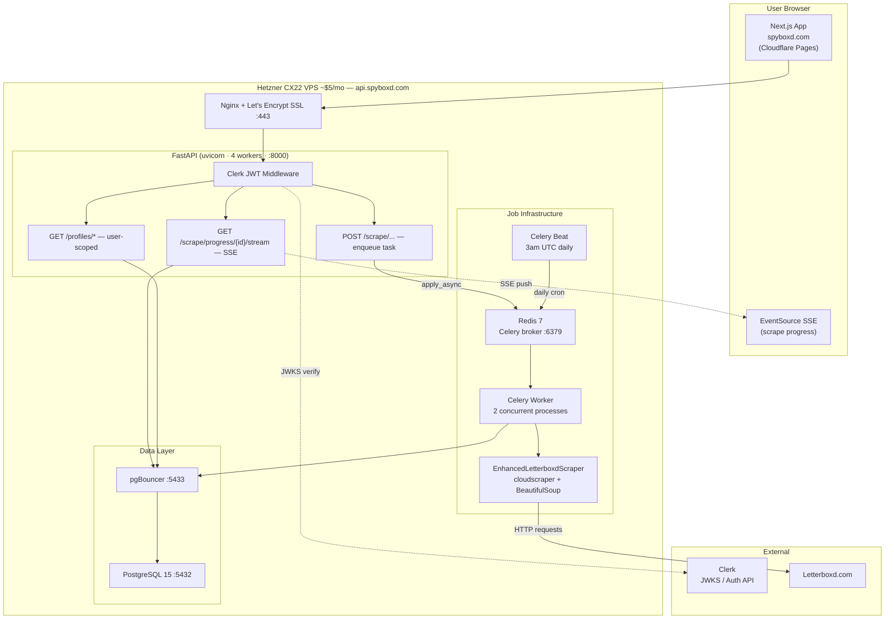

# spyboxd.com — Deployment Plan & Next Steps

## Conversation Summary

This document captures the full deployment architecture designed across our planning session for evolving **letterboxd-reviewer** into a production multi-user product at **spyboxd.com**.

---

## What We Started With

The app is a single-user local tool:

- **Frontend**: React 19 + TypeScript (CRA), runs on `localhost:3000`
- **Backend**: FastAPI (Python) using `BackgroundTasks` for scraping
- **Database**: SQLite with relative file path
- **Scraper**: `EnhancedLetterboxdScraper` — `cloudscraper` + `BeautifulSoup`, takes 2–10 min/profile
- **Auth**: None
- **Deployment**: None (manual shell scripts only)

---

## What We're Building

Multi-user product where users sign up, track Letterboxd profiles, and see per-user dashboards. Key rule: **shared profiles** — if two users track the same username, it's scraped once and data is shared. Daily auto-scraping at 3am UTC, plus user-triggered manual re-scrapes (rate-limited to once per 2 hours).

---

## Final Architecture



### Data Flow

```
1. LOGIN:    Browser → Clerk UI → JWT issued
2. TRACK:    Browser → POST /profiles/track → FastAPI (JWT verified)
                     → insert user_tracked_profiles
                     → if new profile: enqueue Celery scrape job
3. SCRAPE:   Celery Worker → EnhancedLetterboxdScraper → Letterboxd.com
                           → writes ratings/reviews to Postgres
                           → updates scraping_jobs.progress_pct
4. PROGRESS: Browser EventSource → GET /scrape/progress/{id}/stream
                     ← FastAPI polls DB every 1.5s, pushes JSON events
                     ← connection closes when status = completed/failed
5. DAILY:    Celery Beat (3am UTC) → query profiles last_scraped_at > 23h
                                   → enqueue jobs (deduplicated)
6. MANUAL:   Browser → POST /scrape/manual/{username}
                     → check scrape_rate_limits (2hr window) → 429 if hit
                     → else: enqueue + log rate limit record
```

---

## Key Decisions

| Decision | Choice | Reason |
|----------|--------|--------|
| Auth | **Clerk** | Pre-built components, simple FastAPI JWT verification, free ≤10k MAU |
| Database | **PostgreSQL on same VPS** | Zero network latency for scraper bulk writes |
| Job queue | **Celery + Redis** | Out-of-process workers; API never blocked by scraping |
| Scheduler | **Celery Beat** | Daily cron for auto-scraping all stale profiles |
| Progress updates | **SSE** | Replaces polling loop; no extra infrastructure |
| Backend hosting | **Hetzner CX22** | Persistent processes, no timeout limits, ~$5/mo |
| Frontend hosting | **Cloudflare Pages** | Free CDN, domain already on Cloudflare |
| Connection pooling | **pgBouncer** | Celery workers open many connections; keeps Postgres stable |

### Why NOT serverless
Scraping takes 2–10 minutes. Serverless platforms (Lambda, Vercel Functions, Cloudflare Workers) have strict timeouts and can't run Python. Not viable.

### Why NOT GitHub Actions for the web server
GHA is a CI/CD runner — can't serve HTTP traffic or accept incoming user requests. No persistent network endpoint. *(Can legitimately replace Celery Beat as a cron trigger in future.)*

### Why NOT Cloudflare D1
D1 is SQLite-compatible but only accessible via Cloudflare Workers JS bindings. SQLAlchemy can't connect to it. No Python runtime on Cloudflare.

### Why PostgreSQL on VPS, not Supabase/Neon
The scraper makes ~50 DB writes per job over 2–10 minutes. Remote DB = 20–100ms per write = 1–5 seconds of avoidable overhead per scrape. Co-located Postgres = 0ms.

---

## New Database Schema

```sql
-- App users (synced from Clerk on first login)
CREATE TABLE users (
    id              UUID PRIMARY KEY DEFAULT gen_random_uuid(),
    clerk_user_id   VARCHAR(64) UNIQUE NOT NULL,
    email           VARCHAR(255) UNIQUE NOT NULL,
    display_name    VARCHAR(100),
    created_at      TIMESTAMPTZ NOT NULL DEFAULT NOW(),
    is_active       BOOLEAN NOT NULL DEFAULT TRUE
);

-- Letterboxd profiles — GLOBAL, shared across all users
CREATE TABLE letterboxd_profiles (
    id                  SERIAL PRIMARY KEY,
    username            VARCHAR(50) UNIQUE NOT NULL,
    display_name        VARCHAR(150),
    bio                 TEXT,
    location            VARCHAR(100),
    profile_image_url   VARCHAR(500),
    join_date           DATE,
    avg_rating          FLOAT DEFAULT 0.0,
    total_films         INTEGER DEFAULT 0,
    total_reviews       INTEGER DEFAULT 0,
    scraping_status     VARCHAR(20) NOT NULL DEFAULT 'pending',
    last_scraped_at     TIMESTAMPTZ,
    last_scrape_error   TEXT,
    extended_metadata   JSONB,
    created_at          TIMESTAMPTZ NOT NULL DEFAULT NOW(),
    updated_at          TIMESTAMPTZ NOT NULL DEFAULT NOW()
);

-- Which users track which profiles (many-to-many)
CREATE TABLE user_tracked_profiles (
    id          SERIAL PRIMARY KEY,
    user_id     UUID NOT NULL REFERENCES users(id) ON DELETE CASCADE,
    profile_id  INTEGER NOT NULL REFERENCES letterboxd_profiles(id) ON DELETE CASCADE,
    nickname    VARCHAR(100),
    added_at    TIMESTAMPTZ NOT NULL DEFAULT NOW(),
    CONSTRAINT uq_user_profile UNIQUE (user_id, profile_id)
);

-- Ratings — belongs to profile, shared across users who track it
CREATE TABLE ratings (
    id              BIGSERIAL PRIMARY KEY,
    profile_id      INTEGER NOT NULL REFERENCES letterboxd_profiles(id) ON DELETE CASCADE,
    movie_title     VARCHAR(300) NOT NULL,
    movie_year      SMALLINT,
    film_slug       VARCHAR(200),
    poster_url      VARCHAR(500),
    rating          FLOAT,
    watched_date    DATE,
    is_rewatch      BOOLEAN NOT NULL DEFAULT FALSE,
    is_liked        BOOLEAN NOT NULL DEFAULT FALSE,
    tags            JSONB,
    CONSTRAINT uq_profile_film UNIQUE (profile_id, film_slug)
);

-- Reviews — belongs to profile, shared
CREATE TABLE reviews (
    id                BIGSERIAL PRIMARY KEY,
    profile_id        INTEGER NOT NULL REFERENCES letterboxd_profiles(id) ON DELETE CASCADE,
    movie_title       VARCHAR(300) NOT NULL,
    movie_year        SMALLINT,
    film_slug         VARCHAR(200),
    review_text       TEXT,
    rating            FLOAT,
    contains_spoilers BOOLEAN NOT NULL DEFAULT FALSE,
    likes_count       INTEGER DEFAULT 0,
    published_date    DATE,
    CONSTRAINT uq_profile_review UNIQUE (profile_id, film_slug, published_date)
);

-- Scraping job queue
CREATE TABLE scraping_jobs (
    id                   BIGSERIAL PRIMARY KEY,
    profile_id           INTEGER NOT NULL REFERENCES letterboxd_profiles(id) ON DELETE CASCADE,
    triggered_by_user_id UUID REFERENCES users(id) ON DELETE SET NULL,
    trigger_type         VARCHAR(20) NOT NULL DEFAULT 'scheduled', -- scheduled|manual|initial
    status               VARCHAR(20) NOT NULL DEFAULT 'queued',    -- queued|in_progress|completed|failed
    celery_task_id       VARCHAR(155),
    progress_stage       VARCHAR(50),
    progress_pct         FLOAT DEFAULT 0.0,
    progress_message     TEXT,
    queued_at            TIMESTAMPTZ NOT NULL DEFAULT NOW(),
    started_at           TIMESTAMPTZ,
    completed_at         TIMESTAMPTZ,
    error_message        TEXT,
    retry_count          SMALLINT NOT NULL DEFAULT 0,
    job_type             VARCHAR(50) NOT NULL DEFAULT 'full_scrape'
);

-- Rate limit log for manual scrape triggers
CREATE TABLE scrape_rate_limits (
    id           BIGSERIAL PRIMARY KEY,
    user_id      UUID NOT NULL REFERENCES users(id) ON DELETE CASCADE,
    profile_id   INTEGER NOT NULL REFERENCES letterboxd_profiles(id) ON DELETE CASCADE,
    requested_at TIMESTAMPTZ NOT NULL DEFAULT NOW()
);
```

---

## What Changes in the Code

| File | Current | Change |
|------|---------|--------|
| `backend/database/models.py` | Single-tenant schema | Rewrite with multi-tenant schema above |
| `backend/main.py` — CORS | Hardcoded `localhost:3000` | Read from `CORS_ORIGINS` env var |
| `backend/main.py` — scraping | `BackgroundTasks` | `scrape_profile_task.apply_async()` |
| `backend/main.py` — progress | Polled endpoint | `GET /scrape/progress/{id}/stream` SSE |
| `backend/main.py` — auth | None | `verify_clerk_token()` dependency on all routes |
| `backend/database/connection.py` | SQLite default | PostgreSQL via `DATABASE_URL` env var |
| `backend/scraper.py` | Unchanged | Moved into `backend/tasks/scrape.py` as Celery task body |
| `frontend/` | React CRA | Migrate to Next.js App Router (or keep React + deploy to Cloudflare Pages) |
| `frontend/services/api.ts` | Plain axios | Inject `Authorization: Bearer <clerk-jwt>` header |
| `frontend/pages/Scraper.tsx` | `setTimeout` poll loop | `new EventSource(...)` |

**`backend/scraper.py` — zero changes needed.** The scraper class is used as-is inside the Celery task.

---

## VPS Process Layout

```
# systemd services on Hetzner CX22
postgresql.service       ← Postgres :5432 (localhost only)
pgbouncer.service        ← Connection pool :5433 (localhost only)
redis.service            ← Celery broker :6379 (localhost only)
spyboxd-api.service      ← uvicorn main:app --workers 4 --port 8000
spyboxd-worker.service   ← celery -A tasks worker --concurrency 2
spyboxd-beat.service     ← celery -A tasks beat (daily 3am UTC scheduler)
nginx.service            ← Reverse proxy :443 with Let's Encrypt SSL
```

---

## Monthly Cost

| Service | Cost |
|---------|------|
| Hetzner CX22 (VPS — all backend services) | ~$5/month |
| Cloudflare Pages (frontend) | $0 |
| Clerk (auth, ≤10k MAU) | $0 |
| Domain spyboxd.com (already on Cloudflare) | ~$1/month |
| **Total** | **~$6/month** |

Scale path: Hetzner CX32 (~$8.50) if scrape queue grows. Clerk free until 10k users.

---

## Next Steps (Ordered Implementation)

### Phase 1 — Postgres Migration
- [ ] Install PostgreSQL locally (`brew install postgresql@15`)
- [ ] Rewrite `backend/database/models.py` with the multi-tenant schema above
- [ ] Set up Alembic: `pip install alembic`, `alembic init alembic`, generate initial migration
- [ ] Set `DATABASE_URL=postgresql://localhost/spyboxd` in local `.env`
- [ ] Verify all existing API endpoints work unchanged (SQLAlchemy abstracts the backend)
- [ ] Write one-time script to migrate existing SQLite data into the new Postgres schema

### Phase 2 — Auth (Clerk)
- [ ] Create Clerk account → New application "spyboxd" → enable Email + Google
- [ ] Install Clerk SDK in frontend (`@clerk/clerk-react` or `@clerk/nextjs`)
- [ ] Wrap app in `<ClerkProvider publishableKey={...}>`
- [ ] Add Sign In / Sign Up pages, protect all routes with `<SignedIn>`
- [ ] Add `verify_clerk_token()` FastAPI dependency (validates JWT against Clerk's JWKS endpoint)
- [ ] On first login: upsert a row in `users` table using Clerk's `user_id`
- [ ] Update "add profile" flow to insert into `user_tracked_profiles` (not just `letterboxd_profiles`)

### Phase 3 — Celery Job Queue
- [ ] `pip install celery redis`
- [ ] Create `backend/celery_app.py` (Celery instance, Redis broker URL)
- [ ] Create `backend/tasks/scrape.py` — move `run_scraping_task()` body here as a Celery task
- [ ] In `main.py`, replace `background_tasks.add_task(...)` with `scrape_profile_task.apply_async(args=[job.id])`
- [ ] Implement `enqueue_scrape_if_not_active()` with Postgres advisory lock for deduplication
- [ ] Start Redis + Celery worker locally, verify scraping works end-to-end

### Phase 4 — SSE Progress (replaces polling)
- [ ] Add `GET /scrape/progress/{job_id}/stream` SSE endpoint to `main.py`
- [ ] Add 15-minute max timeout to the SSE generator (prevents zombie connections)
- [ ] Update `frontend/pages/Scraper.tsx` — replace `setTimeout` poll loop with `new EventSource(...)`
- [ ] Handle `EventSource` close on `status === 'completed'` or `'failed'`

### Phase 5 — Daily Scheduler
- [ ] Add `schedule_daily_scrapes` Celery task: query `last_scraped_at < NOW() - 23h`, enqueue each
- [ ] Configure Celery Beat: `crontab(hour=3, minute=0)` in `celery_app.py`
- [ ] Test locally by temporarily lowering the cron interval

### Phase 6 — Provision Hetzner VPS
- [ ] Create Hetzner account → New project "spyboxd" → CX22, Ubuntu 24.04, Frankfurt
- [ ] Note the IPv4 address
- [ ] SSH in, create `deploy` user, disable root SSH login, install Docker (optional) or raw services
- [ ] Install: PostgreSQL 15, pgBouncer, Redis 7, Python 3.11, Nginx, Certbot
- [ ] Create systemd unit files for all 6 services (api, worker, beat, postgres, pgbouncer, redis)
- [ ] Clone repo to `/opt/spyboxd`, create `.env` with production secrets
- [ ] Run `certbot --nginx -d api.spyboxd.com` for SSL
- [ ] Set GitHub Secrets: `VPS_HOST`, `VPS_USER`, `VPS_SSH_KEY`
- [ ] Add `.github/workflows/deploy.yml` — build check + SSH deploy on push to `main`

### Phase 7 — Frontend Deploy (Cloudflare Pages)
- [ ] Connect GitHub repo to Cloudflare Pages
- [ ] Set build command: `npm run build`, output: `out` (Next.js static export) or `build` (CRA)
- [ ] Set environment variables: `NEXT_PUBLIC_API_URL=https://api.spyboxd.com`, Clerk publishable key
- [ ] In Cloudflare DNS: add `A` record for `api` subdomain → Hetzner IP
- [ ] Verify `https://spyboxd.com` loads from Cloudflare CDN
- [ ] Verify `https://api.spyboxd.com/docs` returns FastAPI docs

### Phase 8 — Post-Deploy Hardening
- [ ] Set up UptimeRobot (free) monitors for `https://spyboxd.com` and `https://api.spyboxd.com/profiles/`
- [ ] Daily DB backup cron on VPS: `pg_dump spyboxd | gzip > ~/backups/$(date +%Y%m%d).sql.gz`
- [ ] Keep only 7 days of backups: `find ~/backups/ -name "*.sql.gz" -mtime +7 -delete`
- [ ] Audit `requirements.txt`: remove `selenium` if unused in `scraper.py` (saves ~500MB image size)
- [ ] Set `CORS_ORIGINS=https://spyboxd.com,https://www.spyboxd.com` in VPS `.env`

---

## New Files to Create

```
backend/
├── celery_app.py              # Celery instance + beat schedule config
└── tasks/
    └── scrape.py              # scrape_profile_task + schedule_daily_scrapes

alembic/                       # DB migrations (alembic init alembic)
alembic.ini

.github/
└── workflows/
    └── deploy.yml             # CI: build check → SSH deploy on push to main

nginx.conf                     # Reverse proxy config for api.spyboxd.com
.env.example                   # Template for all required env vars
```
